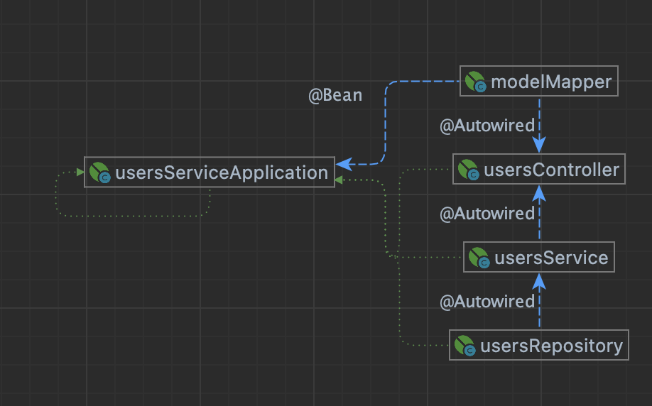
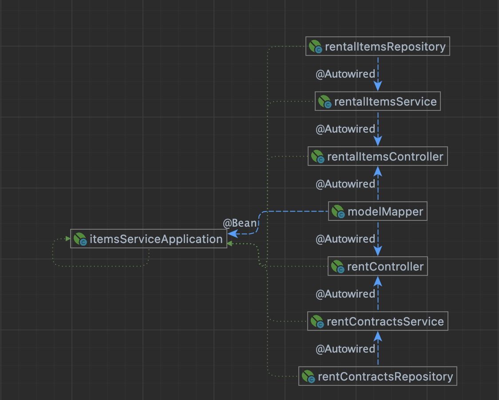
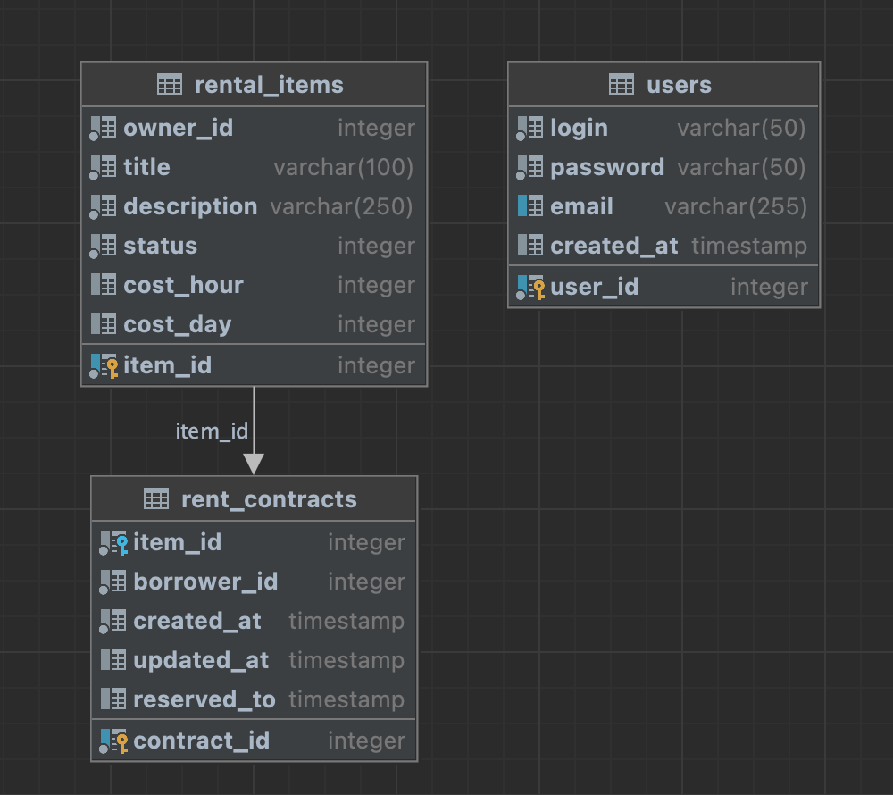

# Rent Service RESTfull Template
### In this project, as an example, for rental objects I used books 
p.s: you can replace all {rental_object} with the real rental object you need
## Проект Spring Boot с PostgreSQL в контейнерах Docker

Этот проект демонстрирует настройку приложения Spring Boot с базой данных PostgreSQL, 
каждое из которых работает в отдельных контейнерах Docker.
Это достигается с использованием Docker Compose для оркестрации развертывания контейнеров.

## Структура проекта

Структура проекта выглядит следующим образом:

```plaintext
RESTApp/
│
├── UsersService/
│   ├── src/
│   │   └── main/
│   │       └── java/
│   ├── Dockerfile.UsersService
│   │
│   └── UsersServicePostgreSQL/
│       ├── Dockerfile.UsersServicePostgreSQL
│       └── init.sql
│
├── ItemsService/
│   ├── src/
│   │   └── main/
│   │       └── java/
│   ├── Dockerfile.ItemssService
│   │
│   └── ItemsServicePostgreSQL/
│       ├── Dockerfile.ItemsServicePostgreSQL
│       └── init.sql
│
└── docker-compose.yml
```

- `UsersService/src/`: Содержит исходный код микросервиса для работы с пользователями.
- `UsersService/Dockerfile.UsersService`: Dockerfile для создания образа UsersService.
- `UsersService/UsersServicePostgreSQL/`: Содержит файлы инициализации базы данных PostgreSQL для UsersService.
- `UsersService/UsersServicePostgreSQL/Dockerfile.UsersServicePostgreSQL`: Dockerfile для создания образа PostgreSQL.
- `UsersService/UsersServicePostgreSQL/init.sql`: SQL-скрипт для создания схемы базы данных и вставки начальных данных.
- `ItemsService/src/`: Содержит исходный код микросервиса для работы с товарами.
- `itemsService/Dockerfile.ItemsService`: Dockerfile для создания образа ItemsService.
- `ItemsService/ItemsServicePostgreSQL/`: Содержит файлы инициализации базы данных PostgreSQL для ItemsService.
- `ItemsService/ItemsServicePostgreSQL/Dockerfile.ItemsServicePostgreSQL`: Dockerfile для создания образа PostgreSQL.
- `ItemsService/ItemsServicePostgreSQL/init.sql`: SQL-скрипт для создания схемы базы данных и вставки начальных данных.
- `docker-compose.yml`: Файл конфигурации Docker Compose для оркестрации развертывания обоих контейнеров.

## UsersService



## ItemsService



## Schema DB




## Начало работы

Следуйте этим шагам для запуска проекта:

1. Клонируйте репозиторий:

   ```bash
   git clone git@github.com:MaksimovSanan/SpringLessons.git
   cd SpringLessons/SpringREST/RESTApp
   ```

2. Соберите и запустите Docker-контейнеры:

   ```bash
   docker-compose up -d
   ```

3. Доступ к приложению Spring Boot:
   1. Users:
      1. GET http://localhost:8095/users
      2. GET http://localhost:8095/users/{id}
      3. POST http://localhost:8095/users
      4. DELETE http://localhost:8095/users/{id}
      5. PATCH http://localhost:8095/users/{id}
   2. Rental items:
      1. GET http://localhost:8096/items
      2. GET http://localhost:8096/items/{id}
      3. POST http://localhost:8096/items
      4. DELETE http://localhost:8096/items/{id}
      5. PATCH http://localhost:8096/items/{id}
   3. Rent contracts:
      1. GET http://localhost:8096/rent
      2. GET http://localhost:8096/rent/{id}
      3. POST http://localhost:8096/rent
      4. DELETE http://localhost:8096/rent/{id}
      5. PATCH http://localhost:8096/rent/{id}


## Настройка

### Приложение Spring Boot

В файле `src/main/resources/application.properties` вы можете настроить параметры подключения к базе данных PostgreSQL:

```properties
spring.datasource.url=jdbc:postgresql://my_postgres_container:5432/rest_app
spring.datasource.username=postgres
spring.datasource.password=postgres
spring.datasource.driver-class-name=org.postgresql.Driver
spring.jpa.database-platform=org.hibernate.dialect.PostgreSQLDialect
```

### База данных PostgreSQL

В файле `postgres/Dockerfile.postgres` вы можете установить переменные среды для PostgreSQL, такие как имя базы данных, пользователя и пароль:

```Dockerfile
ENV POSTGRES_DB=rest_app
ENV POSTGRES_USER=myuser
ENV POSTGRES_PASSWORD=mypassword
```

## Дополнительные замечания

- Приложение Spring Boot доступно по адресу [http://localhost:8080](http://localhost:8080).
- База данных PostgreSQL доступна по адресу [http://localhost:5432](http://localhost:5432).
